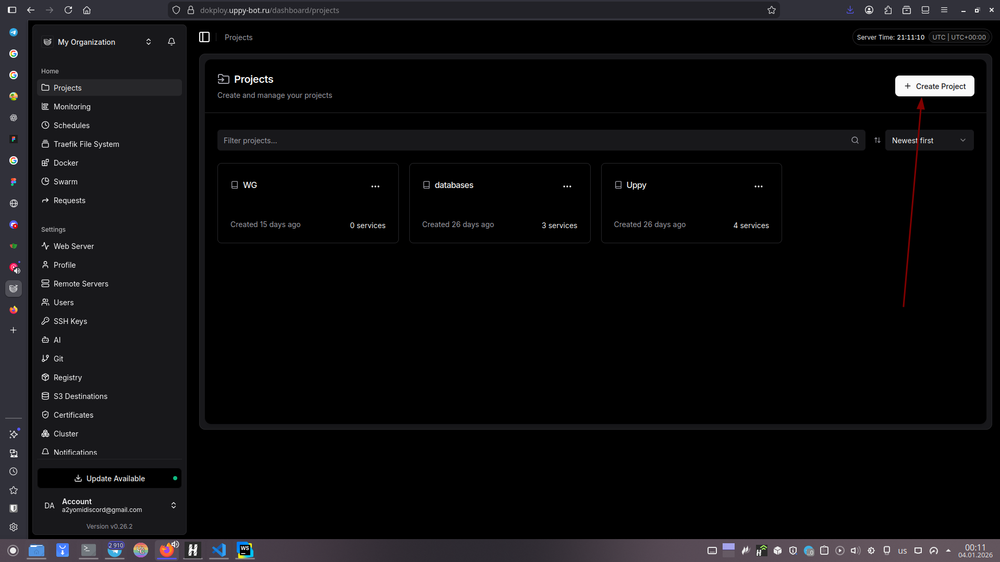
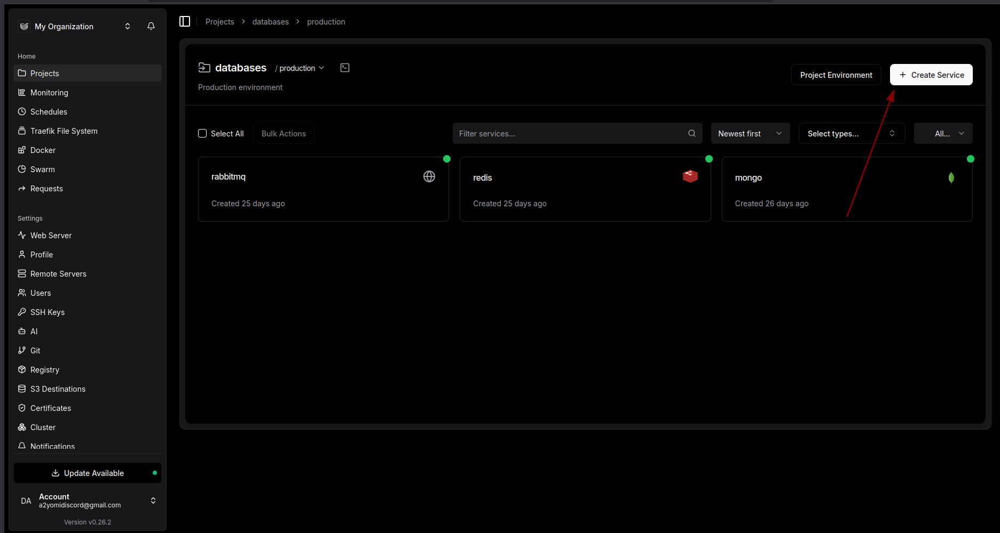
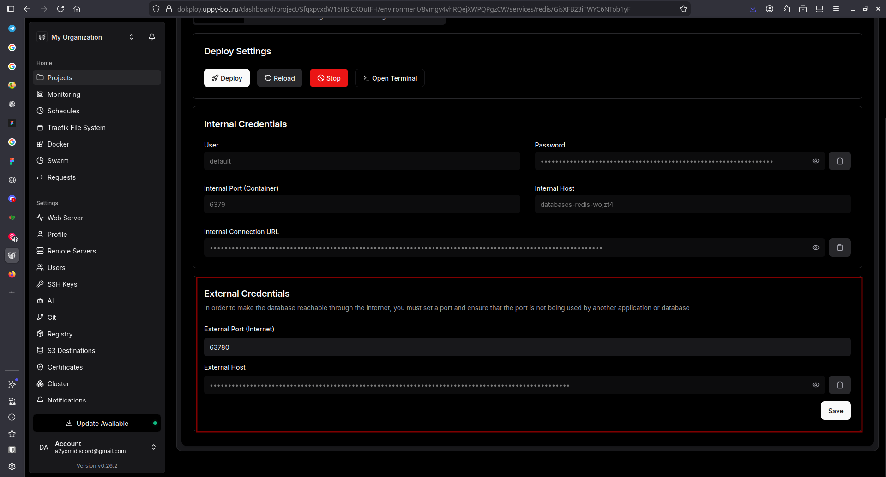
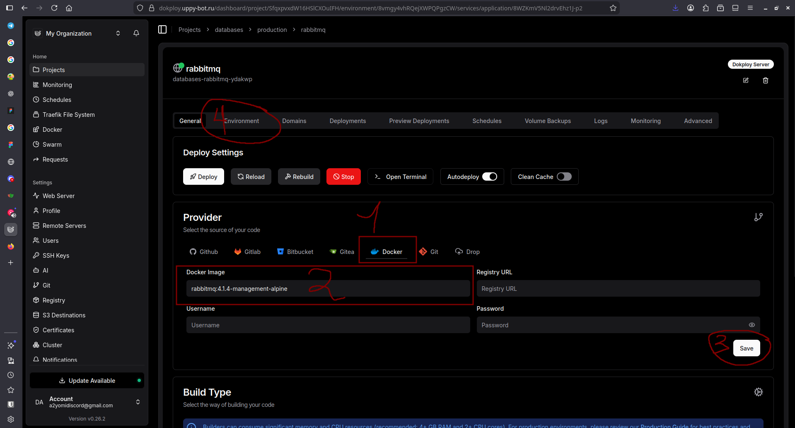
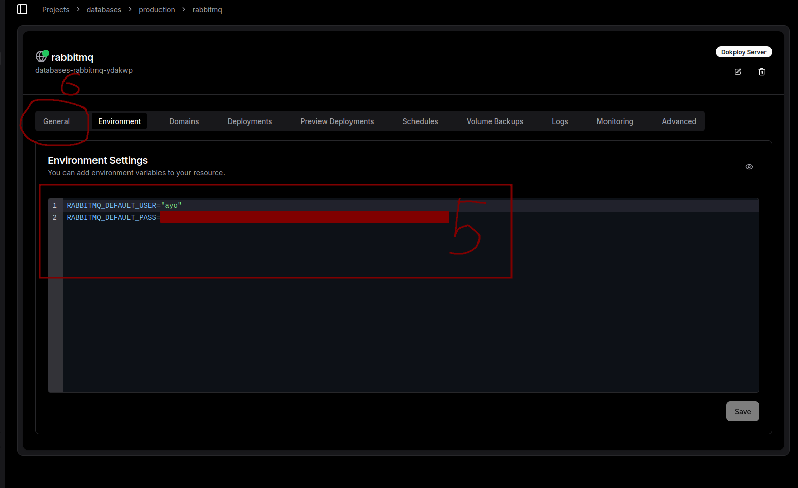
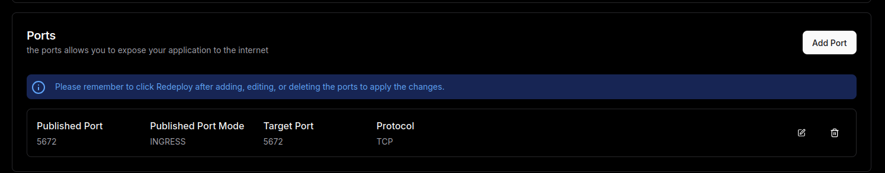
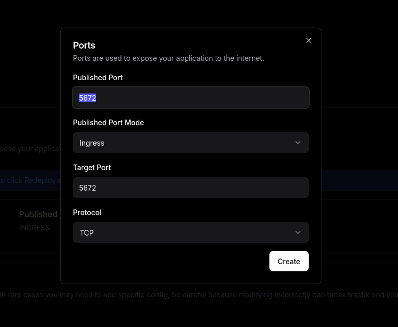
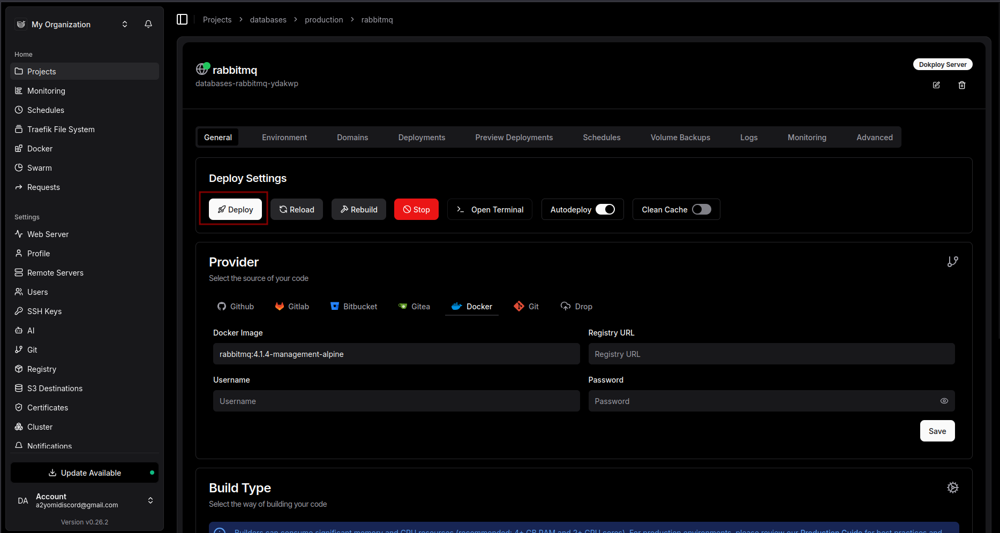

# Небольшой гайд по деплою и запуску (для себя любимого и забывчивого)

Сервисы в Uppy:

1. Redis
2. Mongodb
3. Rabbitmq
4. Telegram бот
5. Discord bot
6. Fastify бекенд

## Для криптографии

```env
ENCRYPTION_KEY="super-secret-key"
```

## Для Redis

```env
REDIS_HOST="localhost"
REDIS_PORT="6379"
REDIS_USER="" # только прод
REDIS_PASSWORD="" # только прод
```

## Для Mongodb

```env
MONGO_URL="mongodb://localhost:27018/?authSource=admin"
```

## Для RabbitMQ

```env
RABBITMQ_URI="amqp://localhost:5672"
```

## Для Telegram

```env
TELEGRAM_TOKEN
MONGO_URL="mongodb://localhost:27018/?authSource=admin"
RABBITMQ_URI="amqp://localhost:5672"
ENCRYPTION_KEY="super-secret-key"

REDIS_HOST="localhost"
REDIS_PORT="6379"
```

## Для Discord

```env
APP_ENV=dev

TELEGRAM_TOKEN="123"

DISCORD_TOKEN="dsfs"

UPPY_URL="http://localhost:4200"
UPPY_INTERNAL_TOKEN="super-secret-token"

MONGO_URL="mongodb://localhost:27018/?authSource=admin"

REDIS_HOST="localhost"
REDIS_PORT="6379"

RABBITMQ_URI="amqp://localhost:5672"
```

## Для Fastify

```env
APP_ENV=dev

DISCORD_CLIENT_ID="123"
DISCORD_CLIENT_SECRET="123"
DISCORD_REDIRECT_URI="http://localhost:4200/discord/callback"

UPPY_URL="http://localhost:4200"
UPPY_INTERNAL_TOKEN="super-secret-token"

MONGO_URL="mongodb://localhost:27018/?authSource=admin"

REDIS_HOST="localhost"
REDIS_PORT="6379"
REDIS_USER=""
REDIS_PASSWORD=""

RABBITMQ_URI="amqp://localhost:5672"
```

## Гайд по установке на vds для всех желающих

Для начала убедитесь, что вы потратили свои 450 рублей на хостинг и научились подключаться по ssh. Научились? Супер! <br />

### Установка Dokploy

Dokploy - платформа, где вы сможете удобно управлять всеми сервисами Uppy

```bash
curl -sSL https://dokploy.com/install.sh | sh
```

### Вход в веб-интерфейс

После установки Dokploy у вас в консоли вывелся url, по которому вы попадёт в веб-интерфейс. Придумайте пароль и введите почту (p.s. необязательно свою, это не валидируется)

### Создайте проект для баз данных

С помощью указанной на скриншоте кнопки создайте проект, назовите его databases



### Создайте сервисы баз данных

Для того, чтобы Uppy смог запуститься, вам потребуется создать следующие сервисы:

1. Rabbitmq
2. Redis
3. Mongodb



**Redis & Mongodb** <br />
Для этих сервис предусмотрены шаблоны. Просто вводите все значения по дефолту, кроме пароля <br />
Далее вам потребуется открыть эти сервисы в "интернет". Сделать это можно здесь:


После этого скопируйте значение из "External host" и куда-нибудь сохраните (это вам понадобится чуть позже)

**RabbitMQ** <br />
К сожалению, для этого сервиса нет встроенного шаблона, поэтому сделаем всё ручками :) <br />
Подобно **Redis** и **Mongodb** создайте на этот раз уже **service** и назовите его **"rabbitmq"** <br/>

После этого следуйте фото-инструкции:











### Запуск - Nodejs (без телеграмм уведомлений)

(Надеюсь вы сможете на гуглить как подготовить nodejs и git на сервере, в конце-концов ChatGPT) <br />

```bash
npm install -g pnpm && git clone https://github.com/Ayomits/UppyBot && cd UppyBot && pnpm install
```

Вставьте следующее <br />

```.env
APP_ENV=prod

DISCORD_TOKEN="ВАШ_ТОКЕН"

MONGO_URL="mongodb://localhost:27018/?authSource=admin"

REDIS_HOST="localhost"
REDIS_PORT="6379"
REDIS_USER=""
REDIS_PASSWORD=""

RABBITMQ_URI="amqp://localhost:5672"
```

MONGO*URL="mongodb://{ВАШЕ*ИМЯ*ПОЛЬЗОВАТЕЛЯ_MONGO_DB}:{ВАШ*ПАРОЛЬ*MONGO_DB}@{АЙПИ*ВАШЕГО_СЕРВЕРА}:27017/?authSource=admin" <br />

REDIS*HOST="АЙПИ*ВАШЕГО*СЕРВЕРА" <br />
REDIS_PORT="6379" <br />
REDIS_USER="ВАШЕ*ИМЯ*ПОЛЬЗОВАТЕЛЯ" <br />
REDIS_PASSWORD="ВАШ*ПАРОЛЬ*ОТ*РЕДИСА" <br />

RABBITMQ*URI="amqp://{ШАГ_2*ПЕРЕМЕНАЯ*RABBITMQ_DEFAULT_USER}:{ШАГ_2*ПЕРЕМЕНАЯ*RABBITMQ_DEFAULT_PASS}@{АЙПИ*ВАШЕГО_СЕРВЕРА}:5672" <br />

```bash
nano .env
```

```bash
npm install -g pm2
```

```bash
pnpm run build && pm2 start --name uppy dist/discord/main.js
```